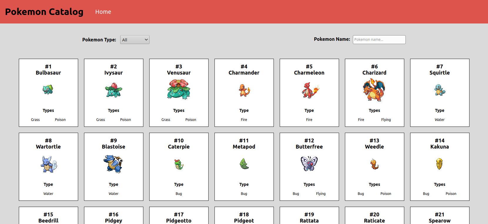
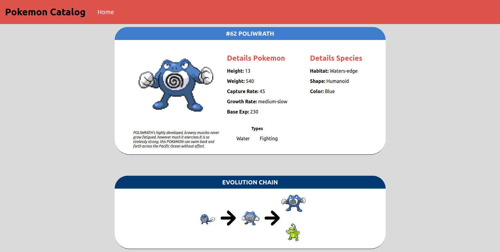

[![Contributors][contributors-shield]][contributors-url]
[![Forks][forks-shield]][forks-url]
[![Stargazers][stars-shield]][stars-url]
[![Issues][issues-shield]][issues-url]

# reactReduxCapstone
On this project, I created a a Catalog of Pokemons, it have 2 pages, a main page listing all the pokemons (on this page you can filter by type and/or name). And a second page with details of each pokemon, showing some information and the evolution chain of that particular pokemon.

At the main page in order to not overload the screen, when 'All' is selected, only the first 50 will show up, loading more when the scrolling is close to the end of the page, creating a better user experience.






## Table of Contents

* [Live Demo](#demo)
* [Installation](#installation)
* [Built With](#built-with)
* [Contributing](#contributing)
* [Acknowledgments](#acknowledgments)
* [Authors](#author)
* [License](#license)


## Live Demo

[Live Demo](https://reactpokecapstone.herokuapp.com/)


## Installation

You can get a local copy of the repository please run the following commands on your terminal:
```
$ cd <folder>
$ git clone https://github.com/Stricks1/reactReduxCapstone.git
```

Run `npm install` and after `npm run build` in your terminal.

Run `npm start` to run on your local machine server

## Built With
- React
- Redux
- HTML
- CSS
- Axious
- PokeAPI
- Jest
- Heroku


## Contributing

Contributions, issues and feature requests are welcome!

You can do it on [issues page](issues/).

## Acknowledgments

Special thanks to code reviewers.

## Show your support

Give a ⭐️ if you like this project!

## Authors

👤 **Gabriel Malheiros Silveira**

- Github: [@Stricks1](https://github.com/Stricks1)
- Linkedin: [Gabriel Silveira](https://linkedin.com/in/gabriel-malheiros-silveira/)
- Twitter: [@Gabriel_Stricks](https://twitter.com/Gabriel_Stricks)

## License

<strong>Creative Commons 2020</strong>

<!-- MARKDOWN LINKS & IMAGES -->

[contributors-shield]: https://img.shields.io/github/contributors/stricks1/reactReduxCapstone.svg?style=flat-square
[contributors-url]: https://github.com/stricks1/reactReduxCapstone/graphs/contributors
[forks-shield]: https://img.shields.io/github/forks/stricks1/reactReduxCapstone.svg?style=flat-square
[forks-url]: https://github.com/stricks1/reactReduxCapstone/network/members
[stars-shield]: https://img.shields.io/github/stars/stricks1/reactReduxCapstone.svg?style=flat-square
[stars-url]: https://github.com/stricks1/reactReduxCapstone/stargazers
[issues-shield]: https://img.shields.io/github/issues/stricks1/reactReduxCapstone.svg?style=flat-square
[issues-url]: https://github.com/stricks1/reactReduxCapstone/issues